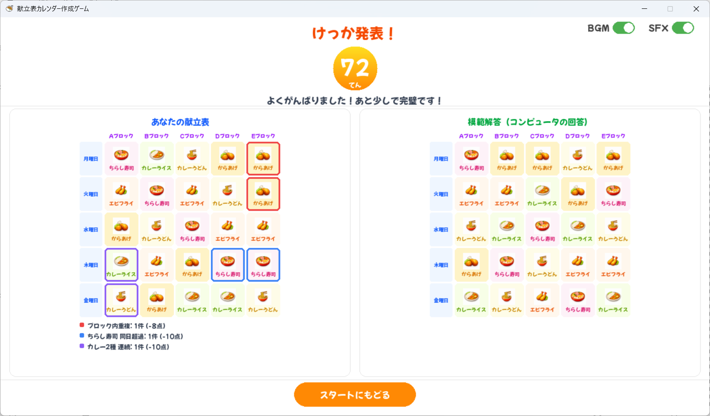

# 献立表パズル

学校給食の献立表をモチーフにした**制約付き配置パズルゲーム**です。
制限時間 3 分以内に、5 種類のメニューを 5 日 x 5 ブロックのグリッドへ配置し、4 つのルールを満たす献立表を完成させましょう。

## スクリーンショット

| スタート画面 | ゲーム実行画面 | 結果確認画面 |
|:---:|:---:|:---:|
|  |  |  |

## 特徴

- ドラッグ & ドロップで直感的にメニューを配置・移動・削除
- リアルタイムの制約違反ハイライト表示
- 100 点満点の採点システム（早解きボーナスあり）
- OR-Tools CP-SAT ソルバーによる模範解答の自動生成
- BGM・効果音のオン/オフ切替

## ゲームルール（4 つの約束）

| # | ルール | 説明 |
|---|--------|------|
| 1 | ブロック内重複禁止 | 同じブロック（列）に同じメニューは 1 回だけ |
| 2 | ちらし寿司は 1 日 1 ブロックまで | 同じ日（行）でちらし寿司は最大 1 つ |
| 3 | 揚げ物は 1 日 3 ブロックまで | 同じ日でからあげ・エビフライの合計は最大 3 つ |
| 4 | カレー 2 種の連続禁止 | 同じブロックで連続する日にカレーうどん <-> カレーライスは NG |

## 必要環境

- Python 3.10 以上
- Windows（動作確認済み）

## インストール & 実行

```bash
# 依存パッケージのインストール
pip install -r requirements.txt

# ゲームの起動
python main.py
```

## テスト

```bash
pytest tests/
```

## プロジェクト構成

```
menu-calendar/
├── main.py                # エントリポイント
├── requirements.txt       # 依存パッケージ
├── assets/
│   ├── config.json        # アセットパス設定
│   ├── icons/             # メニューアイコン (PNG)
│   ├── sounds/            # 効果音 (WAV)
│   ├── bgm/               # BGM (WAV)
│   └── fonts/             # フォント
├── src/
│   ├── constants.py       # 定数・色・ルール定義
│   ├── game.py            # 画面状態管理
│   ├── asset_manager.py   # アセット読み込み
│   ├── model/
│   │   ├── board.py       # 5x5 盤面クラス
│   │   ├── rules.py       # 制約違反検出
│   │   ├── scoring.py     # 採点ロジック
│   │   └── solver.py      # CP-SAT ソルバー
│   └── ui/
│       ├── start_screen.py   # スタート画面
│       ├── play_screen.py    # ゲーム実行画面
│       ├── result_screen.py  # 結果確認画面
│       └── ...               # UI 部品
└── tests/                 # ユニットテスト
```

## 使用技術

- [Pygame-CE](https://pyga.me/) - ゲームフレームワーク
- [OR-Tools](https://developers.google.com/optimization) - 制約充足ソルバー (CP-SAT)
